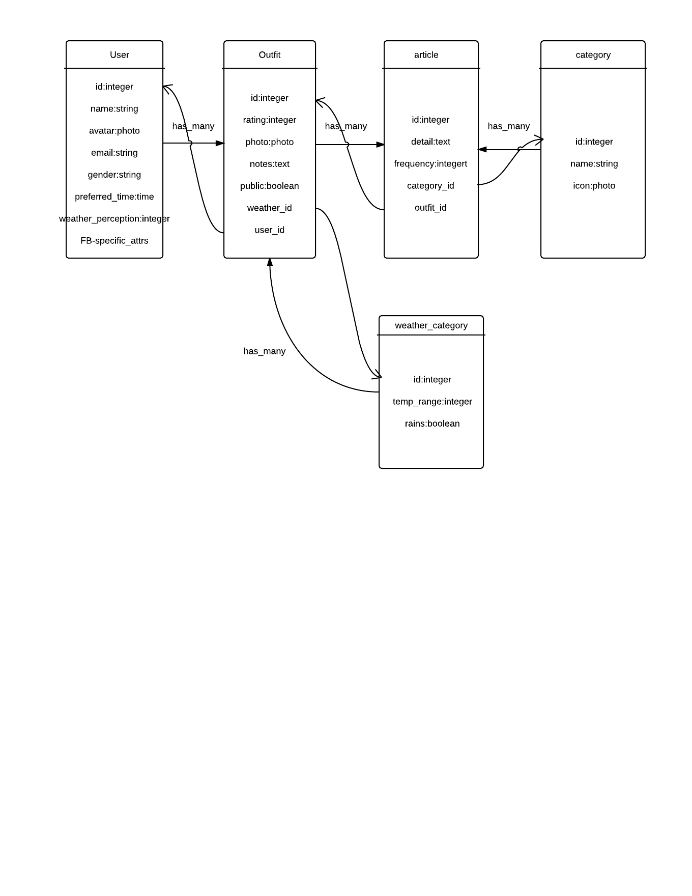

# Comfy-weather-server

## About Comfy Weather and the Comfy Weather Server

Comfy Weather is a mobile application for iOS and Android that provides users with daily outfit recommendations based both on the current temperature and the user's indicated comfort level in previously recommended outfits. 

This is the Comfy Weather server. It was built using Ruby on Rails. I designed the database structure and created the endpoints to create, edit, and delete outfits and articles of clothing as well as provide outfit recommendations. I regularly interfaced with iOS and Android developers to modify JSON responses to best suite their needs.

To find descriptions of each endpoint, **visit the Wiki** at https://github.com/margaretoti/comfy-weather-rails/wiki

## Getting Started

After you have cloned this repo, run this setup script to set up your machine
with the necessary dependencies to run and test this app:

    % ./bin/setup

It assumes you have a machine equipped with Ruby, Postgres, etc. If not, set up
your machine with [this script].

[this script]: https:// .com/thoughtbot/laptop

After setting up, you can run the application using [Heroku Local]:

    % heroku local

[Heroku Local]: https://devcenter.heroku.com/articles/heroku-local

## Guidelines

Use the following guides for getting things done, programming well, and
programming in style.

* [Protocol](http://github.com/thoughtbot/guides/blob/master/protocol)
* [Best Practices](http://github.com/thoughtbot/guides/blob/master/best-practices)
* [Style](http://github.com/thoughtbot/guides/blob/master/style)

## Deploying

If you have previously run the `./bin/setup` script,
you can deploy to staging and production with:

    $ ./bin/deploy staging
    $ ./bin/deploy production

## ER Diagram

